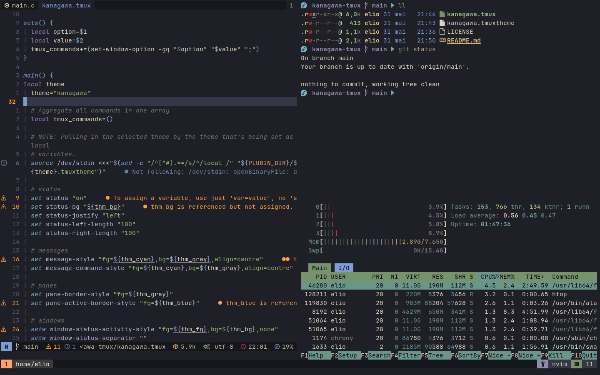

# Kanagawa for tmux
  This is a fork of [dreamsofcode-io/catppuccin-tmux](https://github.com/dreamsofcode-io/catppuccin-tmux), but using the [kanagawa](https://github.com/rebelot/kanagawa.nvim) colorscheme.

## Screenshot :


## Usage

### TPM

1. Install [TPM](https://github.com/tmux-plugins/tpm)
2. Add the kanagawa-tmux plugin:

```bash
set -g @plugin 'https://gitlab.com/eliobtl1/tmux'
# ...alongside
set -g @plugin 'tmux-plugins/tpm'
```

### Manual

1. Copy your desired theme's configuration contents into your Tmux config (usually stored at `~/.tmux.conf`)
2. Reload Tmux by either restarting the session or reloading it with `tmux source-file ~/.tmux.conf`

#### Configuration options

This theme support certain levels of customization. To add these customizations, add any of the following
options to your Tmux configuration.

In order to have the correct icons displayed please use your favorite nerd fonts patched font.

##### Enable window tabs

By default, the theme places the `window-status` in the `status-right`. With
`@kanagawa_window_tabs_enabled` set to `on`, the theme will place the
directory within the `status-right` and move the window names to the
`window-status` format variables.

```sh
set -g @kanagawa_window_tabs_enabled on # or off to disable window_tabs
```

##### Configure separator

By default, the theme will use a round separator for left and right.
To overwrite it use `@kanagawa_left_separator` and `@kanagawa_right_separator` 

```sh
set -g @kanagawa_left_separator "█"
set -g @kanagawa_right_separator "█"
```

##### Enable DateTime

By default, the `date_time` componenet is set to off.
It can be enabled by specifing any tmux date and time format.

```sh
set -g @kanagawa_date_time "%Y-%m-%d %H:%M"
```

##### Enable User

By default, the `user` componenet is set to off.
It can be enabled by toggoling it on.

```sh
set -g @kanagawa_user "on"
```

##### Enable Host

By default, the `host` componenet is set to off.
It can be enabled by toggoling it on.

```sh
set -g @kanagawa_host "on"
```
